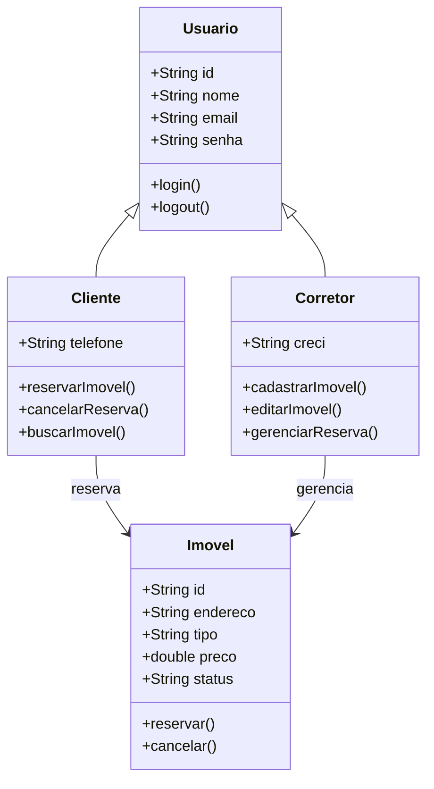
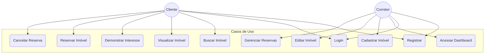
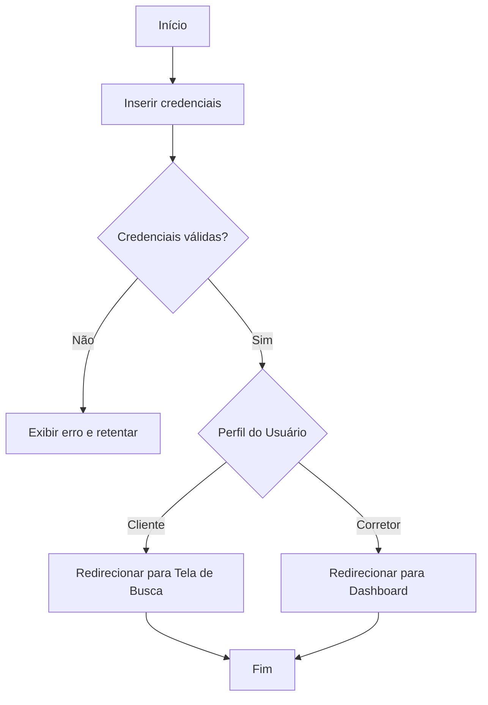
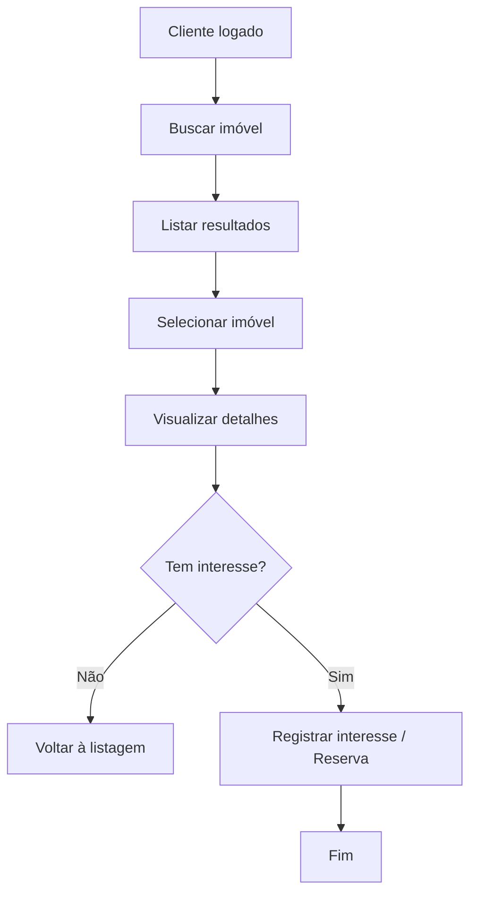
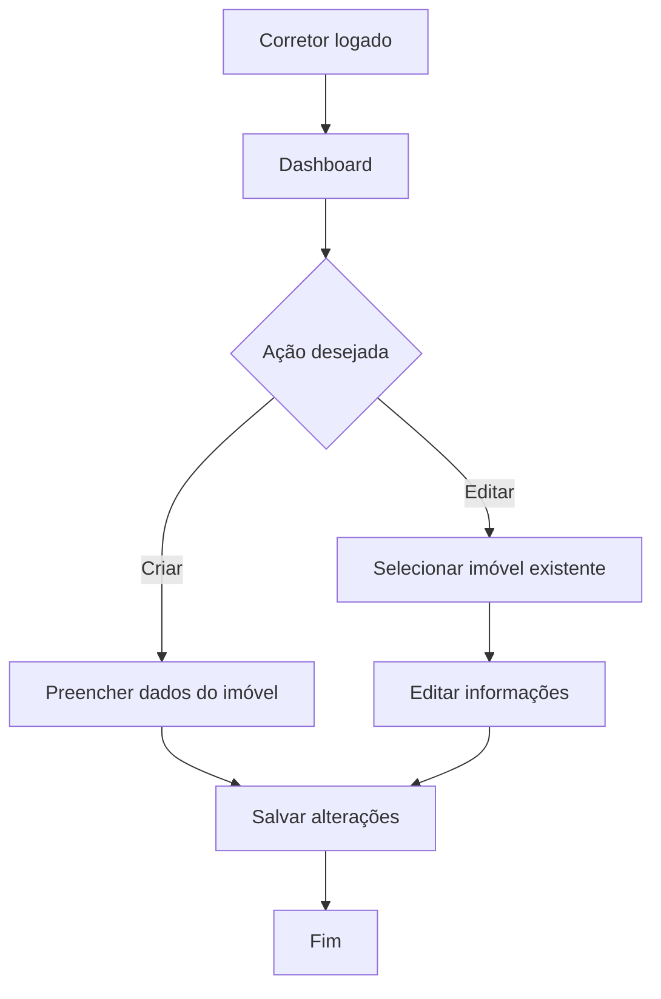

#  Imobiliária Prime - Formativa

Construir uma aplicação web do zero.  
A Imobiliária Prime permitirá gerenciar imóveis, clientes e corretores, possibilitando cadastro, busca e reserva de imóveis, com integração a um backend simulado via JSON Server.

---

##  Objetivos
- Criar uma plataforma para cadastro e gerenciamento de imóveis.  
- Permitir a associação de clientes a reservas de imóveis.  
- Controlar o cadastro de corretores que intermediam negociações.  
- Listar e buscar imóveis por filtros (localização, preço, tipo).  

---

##  Levantamento de Requisitos do Projeto
###  Funcionais
- Cadastro de usuários (corretores e clientes).  
- Cadastro de imóveis.  
- Listar e buscar imóveis por filtros.  
- Reservar um imóvel.  
- Cancelar reserva.  
- Editar e remover imóveis (corretor).  

###  Não Funcionais
- Interface responsiva (Angular).  
- Persistência de dados (JSON Server / db.json).  
- Escalabilidade para integração futura com banco real.  
- Facilidade de uso (UX amigável).  

---

##  Recursos do Projeto
- Angular  
- TypeScript  
- JSON Server (db.json como banco simulado)  
- VSCode  

---

### Diagramas
-    ##  Diagrama de Classes

-    ## Diagrama de Casos de Uso

-   ## Diagramas de Fluxo
 Fluxo de Login e Redirecionamento por Perfil

-   ## Fluxo do Cliente (Busca -> Visualização -> Interesse)

- ## Fluxo do Corretor (Login -> Dashboard -> Criar/Editar Imóvel)
